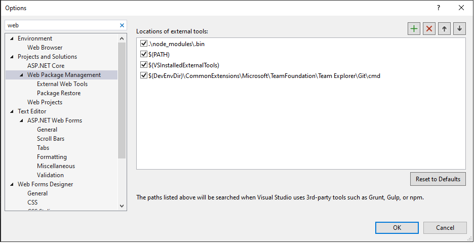
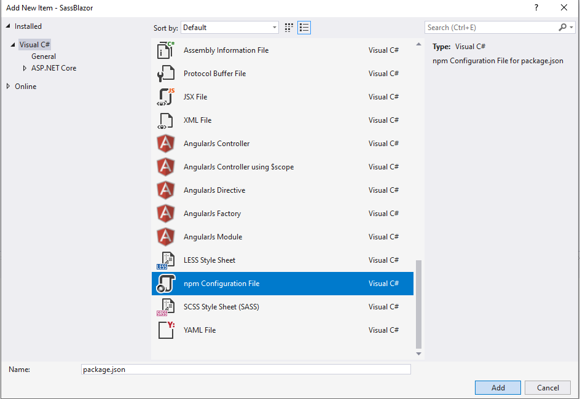
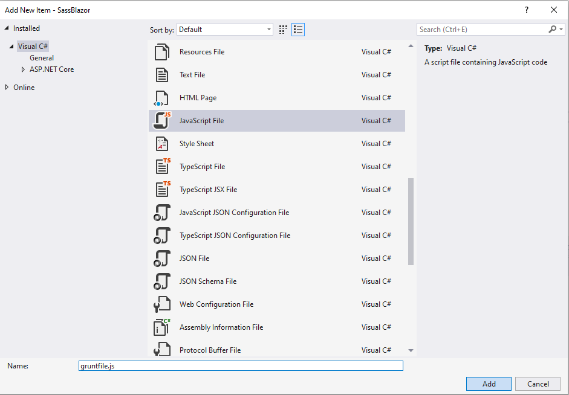
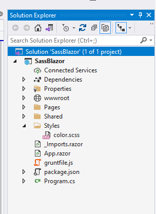
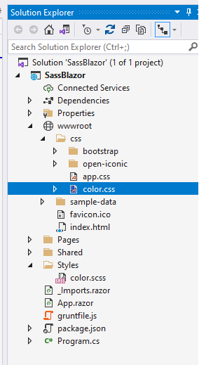
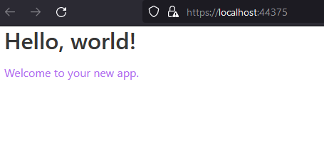

# Using SASS in ASP.NET Core, including Blazor

> Note: This articles was updated in December 2021 to reflect changes to
how Sass is transpiled. As [LibSass is now depreciated](https://sass-lang.com/blog/libsass-is-deprecated), this article now uses a Dart Sass implementation.

[Sass](https://sass-lang.com/) is a css-preprocessor that allows us to create stylesheets for web applications using mixins, variables, functions, and nested rules. These SASS files are then compiled into standard css files for our use. What is nice, ASP.NET Core and Blazor can integrate Sass into the build process. This allows us to write our stylesheets in sass first or even import and modify existing frameworks. Today, we are going to use sass to import the Bulma library and change the primary color with just a few lines of code.

A few things are necessary:

1) An updated version of dotnet Core
2) An updated version of Node.js
3) In Visual Studio, start a new ASP.NET Core Web or Blazor project

The first thing we need to do is make sure our tooling is correct for how Visual Studio will use Grunt.

Go to Options -> Tools -> Projects and Solutions -> Web Package Management. Make sure it looks like this:



Once that is ready, we need to add a package.json to our solution because we will be using a few npm packages to handle our sass to css compilation.

In the Solution Explorer at the solution level, right-click -> Add -> New Item -> npm Configuration File



Once the file is added, open the command prompt or Git Bash then navigate to the solution level where the package.json file is located. (One of the easiest methods of navigation is in File Explorer, right-click -> Git Bash Here)

We want to add the following packages as a dev dependency and Bulma as a normal dependency.

- Grunt
- Grunt CLI
- Grunt Sass
- Sass

You can use the following commands:

npm install bulma
npm install grunt grunt-cli grunt-sass sass --save-dev

Our package.json file should now look like this:

```json
{
  "version": "1.0.0",
  "name": "asp.net",
  "private": true,
  "devDependencies": {
    "grunt": "^1.4.1",
    "grunt-cli": "^1.4.3",
    "grunt-sass": "^3.1.0",
    "sass": "^1.45.1"
  },
  "dependencies": {
    "bulma": "^0.9.3"
  }
}
```

Note: Your version numbers will probably be different as this post was done in the winter of 2021.

Just as we added our package.json at the solution level, right-click -> Add New Item -> Choose a javascript file, and name it "gruntfile.js"



Add the following contents to your new gruntfile:

```javascript
/// <binding AfterBuild='default' />

module.exports = function (grunt) {

    var sass = require('sass');

    grunt.initConfig({

        sass: {
            options: {
                implementation: sass,
                sourceMap: true,
                outputStyle: 'compressed'
            },
            dist: {
                files: [
                    {
                        expand: true,
                        cwd: "Styles",
                        src: ["**/*.scss"],
                        dest: "wwwroot/css",
                        ext: ".css"
                    }
                ]
            }
        }
    });

    grunt.loadNpmTasks('grunt-sass');

    grunt.registerTask('default', ['sass']);
};
```

This tells the pre-processor where to look for our sass files and also where to compile them. Currently, we are saying our sass files will be in a folder called "Styles" that will exist at the same level as our package.json file--at the solution level. We will output the compiled css to the css folder located in the wwwroot. The binding at top says that our pre-process will run after every build.

Note: Your sass files cannot be in the wwwroot folder, which is reserved for serving only static files.

Add your "Styles" folder, or whatever you wish to call it, then create an sass file inside of it.
Here is what it looks like at the solution level:


I am going to change the primary color in Bulma from its default of turquoise to something different. This post is not concerned with teaching Bulma. Changing a color is simply a common use case.

```scss
@charset "utf-8";

// Define a variable.
$orchird: #AF69EF;

// Update bulma's primary color
$primary: $orchird;

// Import the rest of bulma
@import "../node_modules/bulma/bulma";

```

All we have done is updated the primary color and imported the rest of the library.

Now, we just build our solution, and our color.css file should be generated.

Note: I unloaded and reloaded the solution to get Visual Studio to fully recognize the gruntfile.

Our color.css file being generated:



The last step is to import our new css file into our application and test it out:

Our index.html with our css import:

```html
<!DOCTYPE html>
<html>

<head>
    <meta charset="utf-8" />
    <meta name="viewport" content="width=device-width, initial-scale=1.0, maximum-scale=1.0, user-scalable=no" />
    <title>SassBlazor</title>
    <base href="/" />
    <link href="css/color.css" rel="stylesheet" />
</head>

<body>
    <div id="app">Loading...</div>
<script src="_framework/blazor.webassembly.js"></script>
</body>

</html>
```

And our Index page to look at our update:

```html
@page "/"

<h1>Hello, world!</h1>

<p class="has-text-primary">Welcome to your new app.</p>
```

Our final result with a new primary color:


