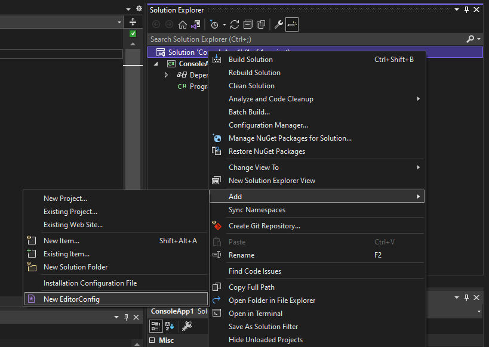
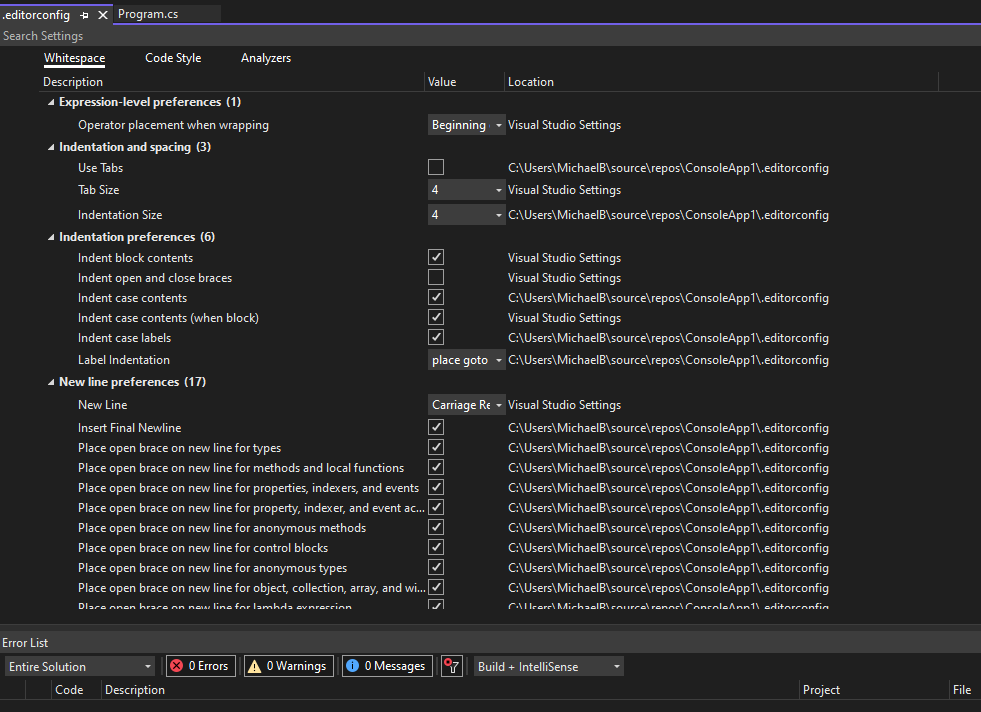

# Two nuget packages for every dotnet project

If you are using dotnet, make your life easier and add the [dotnet analyzers](https://docs.microsoft.com/en-us/dotnet/framework/code-analyzers) and [StyleCop](https://github.com/DotNetAnalyzers/StyleCopAnalyzers) to your project.

The dotnet analyzers enforce the coding standards that Microsoft has deemed to be "best practice".

StyleCop is a code analyzer of the StyleCop style rules that enforce proper spacing, readability, and layout.

You can use a [Directory.build.props](https://docs.microsoft.com/en-us/visualstudio/msbuild/customize-your-build?view=vs-2022) file that will add the packages to every separate project in your solution.

Create a file called "Directory.build.props" at the root of your project, at the same level as your solution file.

```csharp
<Project>
    <PropertyGroup>
        <EnableNETAnalyzers>True</EnableNETAnalyzers>
        <EnforceCodeStyleInBuild>True</EnforceCodeStyleInBuild>
        <AnalysisLevel>latest</AnalysisLevel>
    </PropertyGroup>
    <ItemGroup>
        <PackageReference Include="StyleCop.Analyzers" Version="1.2.0-beta.376">
            <PrivateAssets>all</PrivateAssets>
            <IncludeAssets>runtime; build; native; contentfiles; analyzers; buildtransitive</IncludeAssets>
        </PackageReference>
    </ItemGroup>
</Project>
```

This will add the analyzers and StyleCop to every project in the solution.

You can then override and customize any rule you want with an [.editorconfig](https://docs.microsoft.com/en-us/visualstudio/ide/create-portable-custom-editor-options?view=vs-2022) file at the same directory level.

Visual Studio can generate this file for you in the solution.

In the Solution Explorer, Right-click over the solution file, "Add", "New EditorConfig".



Visual Studio has support to easily change and update this file inside the IDE itself.



